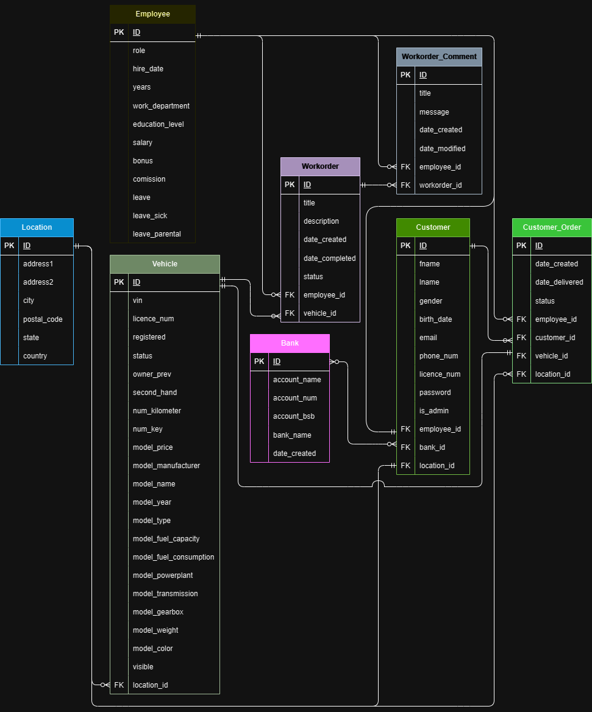

<h1>Installation</h1>

<h3>Setting Up Database </h3>
<details><summary><b>Instructions</b></summary>

1. Install <a url=https://www.postgresql.org/download/>PostgreSQL</a> if not already installed.
2. Open a terminal and type 
```sh 
sudo -u postgres psql
```
3. Create database called: vehicle_db: 
```sh
CREATE DATABASE vehicles_db;
```
4. Enter the database:
```sh 
\c vehicles_db
```
5. Create a user called db_manager with a password: 
```sh
CREATE USER db_manager WITH PASSWORD '123456';
```
6. Create priviliges to user: 
```sh
GRANT ALL PRIVILEGES ON DATABASE vehicles_db TO db_manager;
```
7. If Postgres permission denied for schema public. Input into terminal: 
```sh
GRANT ALL ON SCHEMA public TO db_manager;
```

EXTRA: 
- To remove database: 
```sh
DROP DATABASE vehicle_db;
```
- To remove user: 
```sh
DROP USER db_manager;
```
</details>

<h3>Setting Up Flask</h3>
<details><summary><b>Instructions</b></summary>

1. Check for Python 3.10 or above via the terminal with: 
```sh
python --version
```
If not install <a url=https://www.python.org/downloads/>Python</a>

2. Clone repository in the terminal: 
```sh
git clone git@github.com:R-Z-W/T2A2_Vehicle_CRM.git
```
3. Activate the virtual environment inside the cloned repository: 
```sh
source .venv/bin/activate
```
4. Install requirements: 
```sh
pip install -r requirements.txt
```
5. Place details of database in ```.env.sample``` and rename it to ```.env```:
```sh
DATABASE_URI= ...
JWT_SECRET_KEY= ...
```
6. To create tables: 
```sh
flask db create
```
7. To seed tables: 
```sh
flask db seed
```
8. To drop tables:
```sh
flask db drop
```
9. To run server:
```sh
flask run
```

</details>

<h2>R1 Identification of the problem you are trying to solve by building this particular app.</h2>
With the advent of Covid-19, disrupting supply chains of newly manufactured automobiles and the rising costs of living effecting people’s budgets, the rise of purchasing a second-hand car has become more popular than ever. Due to this, a new disruptive industry of online car dealerships has emerged to capitalise on this opportunity. This app aims to support this industry by providing a package that tracks the vehicle reconditioning process and offers a platform to store information on vehicle inventory, which subsequentially can be readily accessed by customers upon request.

<h2>R2  Why is it a problem that needs solving?</h2>
As costs rise for customers with increased interest rates and inflation, and the disruptions to supply chains further decreasing inventory of vehicles in Australia, the cost of purchasing a new vehicle is financially unattainable for many Australians. Thus, the alternative of purchasing a second-hand car has become a more viable option for many Australians. But in-order to effectively compete in the second-hand market, ways of reducing cost in all aspects of the business need to be considered. By not being constrained by the limitations of physical space, or day to day operations of a traditional walk-in dealership, online car dealerships can set up operations on inexpensive land for the accumulation of a vast inventory of vehicles at a low cost. However, managing such a vast inventory presents challenges, particularly in terms of inventory tracking and presentation to customers. Thus, the aim of this API is to address these challenges and provide solutions for efficient inventory management and display in the online car dealership industry.

<h2>R3	Why have you chosen this database system. What are the drawbacks compared to others?</h2>
I have chosen PostgreSQL as my database system because it is a relational database, making it easy to establishing connections between vehicles and customers, as well as managing relationships between work orders and employees. This database allows for simple data management and retrieval processes and has robust security mechanisms, providing the flexibility and functionality required for my project.

However, PostgreSQL does have its drawbacks compared to other database systems. One such drawback is its comparatively slower performance with large datasets when contrasted with alternatives like MongoDB (non-relational database) or TimescaleDB (relational database). Additionally, PostgreSQL may not match the performance capabilities of distributed database systems, such as Apache Cassandra and Google Cloud Spanner, when it comes to handling high levels of traffic from website visits and/or workorder queries.

<h2>R4	Identify and discuss the key functionalities and benefits of an ORM</h2>
Object-Relational Mapping (ORM) allows for the connection between an object oriented programming language and a relational database. An example of an ORM is SQLAlchemy, a python library which serves as way to interact with the database using the python language. SQLAlchemy achieves this by defining models which are python classes. These models provide the ability to not only perform CRUD operations such as create, read, update and delete, but also uphold data integrity with data validation and a range of data relationships.

<h2>R5	Document all endpoints for your API</h2>

<h4>banks</h4>

| Operation | url | Description | Available Names |
|---|---|---|---|
| GET | http://localhost:8080/banks | Displays all banks | | 
|---|---|---|---|
| GET | http://localhost:8080/banks/{id} | Gets specific bank by (id) | |
|---|---|---|---|
| POST | http://localhost:8080/banks | Creates a new bank | 'account_name', 'account_num', 'account_bsb', 'bank_name'|
|---|---|---|---|
| PATCH | http://localhost:8080/banks/{id} | Updates a existing bank via (id) | 'account_name', 'account_num', 'account_bsb', 'bank_name'|
|---|---|---|---|
| DELETE | http://localhost:8080/banks/{id} | Deletes single bank via (id) |  |

<h4>customers</h4>

| Operation | url | Description | Input Column Names |
|---|---|---|---|
| GET | http://localhost:8080/customers | Displays all customers | | 
|---|---|---|---|
| GET | http://localhost:8080/customers/{id} | Gets specific customer by (id) | |
|---|---|---|---|
| POST | http://localhost:8080/customers | Creates a new customer | 'fname', 'lname', 'gender', 'birth_date', 'email', 'phone_num', 'licence_num', 'password', 'is_admin', 'bank_id', 'location_id', 'employee_id' |
|---|---|---|---|
| PATCH | http://localhost:8080/customers/{id} | Updates a existing customer via (id) |'fname', 'lname', 'gender', 'birth_date', 'email', 'phone_num', 'licence_num', 'password', 'is_admin', 'bank_id', 'location_id', 'employee_id' |
|---|---|---|---|
| DELETE | http://localhost:8080/customers/{id} | Deletes single customer via (id) |  |

<h4>customer_orders</h4>

| Operation | url | Description | Input Column Names |
|---|---|---|---|
| GET | http://localhost:8080/customer_orders | Displays all customer_orders | | 
|---|---|---|---|
| GET | http://localhost:8080/customers_orders/{id} | Gets specific customer_order by (id) | |
|---|---|---|---|
| POST | http://localhost:8080/customer_orders | Creates a new customer_order | 'location_id', 'customer_id', 'vehicle_id', 'employee_id', 'date_created', 'date_delivered', 'status' |
|---|---|---|---|
| PATCH | http://localhost:8080/customers_orders/{id} | Updates a existing customer_order via (id) |'location_id', 'customer_id', 'vehicle_id', 'employee_id', 'date_created', 'date_delivered', 'status' |
|---|---|---|---|
| DELETE | http://localhost:8080/customers_orders/{id} | Deletes single customer_order via (id) |  |

<h4>locations</h4>

| Operation | url | Description | Available Names |
|---|---|---|---|
| GET | http://localhost:8080/locations | Displays all locations | | 
|---|---|---|---|
| GET | http://localhost:8080/locations/{id} | Gets specific location by (id) | |
|---|---|---|---|
| POST | http://localhost:8080/locations | Creates a new location | 'address1', 'address2', 'city', 'postal_code', 'state', 'country'|
|---|---|---|---|
| PATCH | http://localhost:8080/locations/{id} | Updates a existing location via (id) | 'address1', 'address2', 'city', 'postal_code', 'state', 'country' |
|---|---|---|---|
| DELETE | http://localhost:8080/locations/{id} | Deletes single location via (id) |  |

<h4>workorders</h4>

| Operation | url | Description | Available Names |
|---|---|---|---|
| GET | http://localhost:8080/workorders | Displays all workorders | | 
|---|---|---|---|
| GET | http://localhost:8080/workorders/{id} | Gets specific workorder by (id) | |
|---|---|---|---|
| POST | http://localhost:8080/workorders | Creates a new workorder | 'employee_id', 'vehicle_id', 'status', 'title', 'description', 'date_completed'|
|---|---|---|---|
| PATCH | http://localhost:8080/workorders/{id} | Updates a existing workorder via (id) | 'employee_id', 'vehicle_id', 'status', 'title', 'description', 'date_completed'|
|---|---|---|---|
| DELETE | http://localhost:8080/workorders/{id} | Deletes single workorder via (id) |  |

<h4>workorder_comments</h4>

| Operation | url | Description | Available Names |
|---|---|---|---|
| GET | http://localhost:8080/workorder_comments | Displays all workorder_comments | | 
|---|---|---|---|
| GET | http://localhost:8080/workorder_comments/{id} | Gets specific workorder_comment by (id) | |
|---|---|---|---|
| POST | http://localhost:8080/workorder_comments | Creates a new workorder_comment | 'workorder_id', 'employee_id', 'title', 'message', 'date_modified'|
|---|---|---|---|
| PATCH | http://localhost:8080/workorder_comments/{id} | Updates a existing workorder_comment via (id) | 'workorder_id', 'employee_id', 'title', 'message', 'date_modified'|
|---|---|---|---|
| DELETE | http://localhost:8080/workorder_comments/{id} | Deletes single workorder_comment via (id) |  |

<h4>vehicles</h4>

| Operation | url | Description | Available Names |
|---|---|---|---|
| GET | http://localhost:8080/vehicles | Displays all vehicles | | 
|---|---|---|---|
| GET | http://localhost:8080/vehicles/{id} | Gets specific vehicle by (id) | |
|---|---|---|---|
| POST | http://localhost:8080/vehicles | Creates a new vehicle | 'vin', 'licence_num', 'registered', 'status', 'owner_Prev', 'second_hand', 'num_kilometer', 'num_key', 'model_price', 'model_manufacturer', 'model_name', 'model_year', 'model_type', 'model_fuel_type', 'model_fuel_capacity', 'model_fuel_consumption', 'model_powerplant', 'model_transmission', 'model_gearbox', 'model_weight', 'model_color', 'visible', 'location_id'|
|---|---|---|---|
| PATCH | http://localhost:8080/vehicles/{id} | Updates a existing vehicle via (id) | 'vin', 'licence_num', 'registered', 'status', 'owner_Prev', 'second_hand', 'num_kilometer', 'num_key', 'model_price', 'model_manufacturer', 'model_name', 'model_year', 'model_type', 'model_fuel_type', 'model_fuel_capacity', 'model_fuel_consumption', 'model_powerplant', 'model_transmission', 'model_gearbox', 'model_weight', 'model_color', 'visible', 'location_id'|
|---|---|---|---|
| DELETE | http://localhost:8080/vehicles/{id} | Deletes single vehicle via (id) |  |

<h4>employees</h4>

| Operation | url | Description | Available Names |
|---|---|---|---|
| GET | http://localhost:8080/employees | Displays all employees | | 
|---|---|---|---|
| GET | http://localhost:8080/employees/{id} | Gets specific employee by (id) | |
|---|---|---|---|
| POST | http://localhost:8080/employees | Creates a new employee | 'role', 'years', 'work_department', 'education_level', 'salary', 'bonus', 'commission', 'leave', 'leave_sick', 'leave_parental'|
|---|---|---|---|
| PATCH | http://localhost:8080/employees/{id} | Updates a existing employee via (id) | 'role', 'years', 'work_department', 'education_level', 'salary', 'bonus', 'commission', 'leave', 'leave_sick', 'leave_parental'|
|---|---|---|---|
| DELETE | http://localhost:8080/employees/{id} | Deletes single employee via (id) |  |

<h2>R6	An ERD for your app</h2>



<h2>R7	Detail any third party services that your app will use</h2>

- SQLAlchemy:
SQLAlchemy is a Python library that acts as an object-relational mapping (ORM) tool. It enables interaction with the API's database without the necessity of using direct SQL queries. By defining models as Python classes, SQLAlchemy facilitates tasks such as table creation, population, modification, and deletion within the database. It also supports 

- Marshmallow:
Marshmallow is a Python library designed for the serialization and deserialization of data within the API. It allows for the conversion of complex data types, such as Python objects, to and from formats like JSON which is suitable for transmission over networks. Marshmallow employs schemas containing fields that define the structure of data during serialization or deserialization. These fields may include validation rules to ensure that the data meets specified criteria, ensuring data integrity and consistency in the API.

- JWT (Bearer):
JSON Web Tokens (JWT) is used for customer identification within the API. JWT generates a token from customer information that uniquely identifies the customer without the need to store their session information.

<h2>R8	Describe your projects models in terms of the relationships they have with each other</h2>

The project has 8 unique models that serve different purposes in this project. The bank, employee and location models are unique in that they are independent models that do not contain foreign keys. They serve as extensions to the main models, holding additional information that either requires additional security or is not always required when querying the database.
- Bank Model
    - The bank model holds vital information for payments when buying a vehicle or paying salaries to employees. This model does not contain any foreign keys to other models but has a many to many relationship to the customer model inorder to facilitate customers with multiple bank accounts or shared accounts.
- Employee Model
    -  The employee model is used to hold important information about employees. This model utilises a one to many relationshipis throughout the application inorder to link employees to workorders, workorder_comments and customer_orders. This model was also designed to have a one to one relationship to the customer model to prevent duplicate data in the event of a customer becoming an employee or vice versa.
- Location Model
    - Locations are used in many models throughout this application. Thus, seperating locations into its own model was vital in maintaining data integrity inorder to prevent data duplication. This model is used in a one to many relationship for vehicles, customers and customer_orders.

The next 3 models form the main structure of any second hand vehicle dealership, containing vital information that is required for the buisness to function. These are:
- Vehicle Model
    - This model holds essential data required for selling a vehicle to a customer. It holds a one to many relationship to the workorder and customer_order models. 
- Customer Model
    - The customer model contains vital information about customers but also employees. This model has a one to many relationship with the customer_order model allowing customers to purchase multiple vehicles under the same account.
- Workorder Model
    - Without the workorder model, assign and tracking tasks performed on vehicles would be confusing and unorganized, especially in a large operation. This model extends its capability with a workorder_comment model allowing for employees to comment issues that may arise when working on workorders.

The last 2 models attempt to extend and provide convenience to the main models. These include:
- Workorder_Comment Model
    - This model aims to provide an avenue of communication between employees working on workorders. With its many to one relationship, workorders and employees are allowed to create multiple comments on the same or different workorders.
- Customer_Order Model
    - The customer_order model attempts to provide a suitable table that links and tracks all the appropiate information required in generating a sales order. This model has a many to one relationship with the employee, customer and location models as only one of each should be allowed to be linked to a sale. In addition, a one to one relationship between the model and the vehicle model is established as a vehicle should never be in a situation where it is being sold to multiple customers at the same time.


<h2>R9	Discuss the database relations to be implemented in your application</h2>

- One-to-Many Relationships:
    - Employee to Workorders, Workorder_Comments, Customer_Orders: 
        - An employee can be associated with multiple workorders, workorder comments and customer orders. This is represented by a foreign key in the respective models pointing to the Employee model.
    - Location to Vehicles, Customers, Customer_Orders: 
        - Each location can have multiple vehicles, customers, and customer orders associated with it. This is represented by a foreign key in the respective models pointing to the Location model.
    - Workorder to Workorder Comments
        - A workorder can contain 0 or many employee comments. Therefore the workorder comments model should contain a foreign key that represents the workorder it points to.
    - Customer to Customer Order
        - A customer is allowed to have multiple orders depending on how many vehicles they wish to buy. Thus, a customer can have its id utilised in multiple customer orders consequentially required customer orders having a customer foreign key.
    - Vehicle to Workorder
        - Throughout the reconditioning process of a vehicle, multiple workorders are created to assign employees to task to bring the vehicle to a road worthy standard. Thererfore, vehicles must have a one to many relationship with the workorder model.

- Many-to-Many Relationships:
    - Bank to Customer: 
        - Since a customer can have multiple bank accounts and a bank account can have customers share the account, a many-to-many relationship is established between the Bank and Customer models.

- One-to-One Relationships:
    - Employee to Customer: 
        - An employee can also be a customer, and vice versa. To prevent data duplication and maintain integrity, a one-to-one relationship is established between the Employee and Customer models.
    - Vehicle to Customer Order:
        - It is important that a vehicle must only have one customer order to prevent multiple customers from purchasing the same vehicle. Therefore a one to one relationship between both models must be established.
